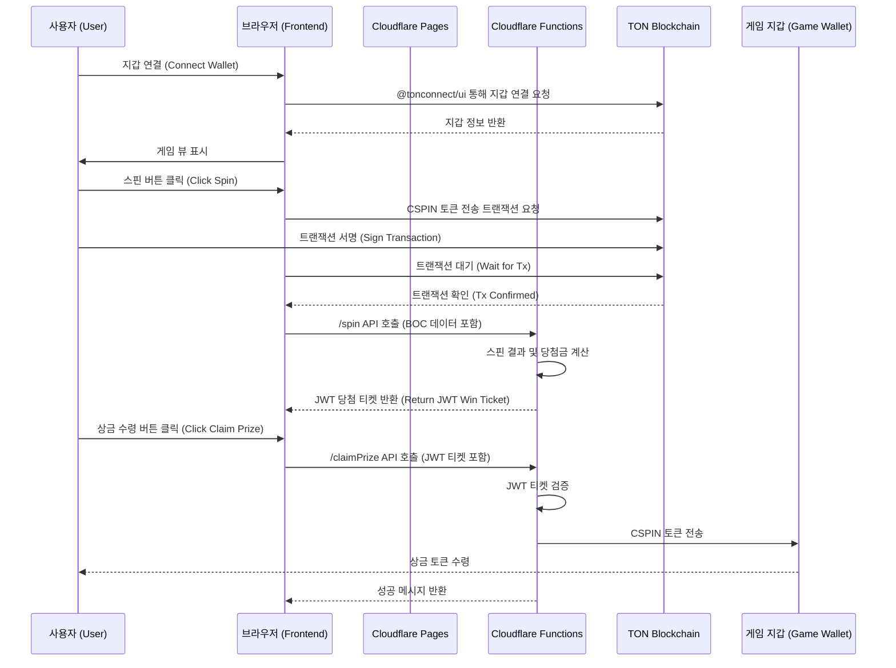

# CandleSpinner: Software Architecture Document

## 1. Overview

(KO) 이 문서는 'CandleSpinner' 프로젝트의 기술적 아키텍처를 정의합니다. 시스템의 구조, 구성 요소, 데이터 흐름, API 명세 등을 상세히 기술하여 일관성 있는 개발을 위한 기술적 청사진을 제공하는 것을 목표로 합니다.
(EN) This document defines the technical architecture for the 'CandleSpinner' project. It aims to provide a technical blueprint for consistent development by detailing the system structure, components, data flow, and API specifications.

---

## 2. Core Philosophy

(KO)

- **서버리스 우선 (Serverless-First):** 모든 인프라는 Cloudflare를 중심으로 구축하여, 별도의 서버 관리 없이 높은 확장성과 비용 효율성을 추구합니다.
- **비수탁형 자산 관리 (Non-Custodial):** 사용자의 자산은 항상 사용자의 지갑에 남아있으며, 프로젝트는 자산을 직접 보관하거나 통제하지 않습니다.
- **상태 비저장 백엔드 (Stateless Backend):** 각 API 함수는 독립적으로 실행되며 상태를 저장하지 않습니다. 상태 관리가 필요한 경우(예: 중복 지급 방지) JWT와 Cloudflare KV를 사용합니다.
- **단일 진실 공급원 (Single Source of Truth):** 모든 요구사항과 아키텍처 정보는 `docs` 폴더 내의 문서들을 통해 관리됩니다.

(EN)

- **Serverless-First:** All infrastructure is built around Cloudflare, aiming for high scalability and cost-effectiveness without server management.
- **Non-Custodial Asset Management:** User assets always remain in the user's own wallet; the project does not store or control them directly.
- **Stateless Backend:** Each API function executes independently and does not store state. State management (e.g., preventing duplicate payouts) is handled using JWT and Cloudflare KV.
- **Single Source of Truth:** All requirements and architectural information are managed through documents in the `docs` folder.

---

## 3. System Diagram

(KO) 아래는 시스템의 주요 구성 요소와 상호작용을 나타내는 다이어그램입니다.
(EN) Below is a diagram showing the main components of the system and their interactions.



---

## 4. Technology Stack & Rationale

| Category       | Technology                 | Rationale (KO)                                                                                              | Rationale (EN)                                                                                                            |
| -------------- | -------------------------- | ----------------------------------------------------------------------------------------------------------- | ------------------------------------------------------------------------------------------------------------------------- |
| **Frontend**   | **Vite**                   | 빠른 개발 서버와 최적화된 빌드 성능을 제공하여 개발 생산성을 높입니다.                                      | Provides a fast development server and optimized build performance, increasing development productivity.                  |
|                | **Vanilla JS/HTML/CSS**    | 외부 UI 프레임워크에 대한 의존성 없이 가볍고 빠른 사용자 경험을 제공합니다.                                 | Delivers a lightweight and fast user experience without dependency on external UI frameworks.                             |
| **Backend**    | **Cloudflare Functions**   | 서버 관리가 필요 없는 서버리스 환경을 제공하며, 글로벌 엣지 네트워크를 통해 빠른 응답 속도를 보장합니다.    | Offers a serverless environment requiring no server management and ensures fast response times via a global edge network. |
| **Hosting**    | **Cloudflare Pages**       | Git 푸시를 통해 간편하게 프론트엔드를 배포하고, Functions와 완벽하게 통합됩니다.                            | Easily deploys the frontend via Git push and integrates seamlessly with Functions.                                        |
| **Blockchain** | **TON (The Open Network)** | 낮은 수수료와 빠른 트랜잭션 속도를 제공하며, Telegram과의 연동을 통해 높은 접근성을 가집니다.               | Offers low fees, fast transaction speeds, and high accessibility through its integration with Telegram.                   |
| **Libraries**  | **@tonconnect/ui**         | TON 지갑 연결을 위한 공식 UI 라이브러리로, 다양한 지갑과의 호환성을 보장합니다.                             | The official UI library for TON wallet connections, ensuring compatibility with various wallets.                          |
|                | **tonweb**                 | TON 블록체인과의 상호작용(트랜잭션 생성, 컨트랙트 호출 등)을 위한 필수 라이브러리입니다.                    | An essential library for interacting with the TON blockchain (creating transactions, calling contracts, etc.).            |
|                | **jose**                   | 백엔드에서 상태 비저장 "당첨 티켓"을 안전하게 생성하고 검증하기 위한 표준 JWT 라이브러리입니다.             | A standard JWT library for securely creating and verifying stateless "win tickets" on the backend.                        |
| **Storage**    | **Cloudflare KV**          | JWT 티켓 재사용 방지와 같은 간단한 키-값 데이터를 저장하기 위한 글로벌 저지연 스토리지입니다. (선택적 사용) | A global, low-latency key-value store for simple data like preventing JWT ticket reuse. (Optional use)                    |

---

## 5. Directory Structure

```
.
├── docs/                   # (KO) 모든 프로젝트 문서 (EN) All project documents
├── functions/              # (KO) Cloudflare Functions (백엔드 API) (EN) Cloudflare Functions (Backend API)
│   ├── spin.js
│   ├── claimPrize.js
│   └── doubleUp.js
├── public/                 # (KO) 정적 에셋 (이미지, 폰트, 언어 파일) (EN) Static assets (images, fonts, language files)
│   ├── lang/
│   │   ├── en.json
│   │   └── ko.json
│   └── icon.png
├── src/                    # (KO) 프론트엔드 소스 코드 (EN) Frontend source code
│   ├── main.js             # (KO) 애플리케이션 진입점 (EN) Application entry point
│   └── style.css           # (KO) 기본 스타일시트 (EN) Base stylesheet
├── .gitignore
├── _routes.json            # (KO) Cloudflare Pages 라우팅 규칙 (EN) Cloudflare Pages routing rules
├── index.html              # (KO) 메인 HTML 파일 (EN) Main HTML file
├── package.json            # (KO) 프로젝트 의존성 및 스크립트 (EN) Project dependencies and scripts
├── vite.config.js          # (KO) Vite 빌드 설정 (EN) Vite build configuration
└── wrangler.toml           # (KO) Cloudflare Functions 설정 (EN) Cloudflare Functions configuration
```

---

## 6. Key Data Flow

(KO)

1.  **지갑 연결:** 사용자가 `@tonconnect/ui` 버튼을 통해 지갑을 연결합니다.
2.  **베팅 및 스핀:**
    - 사용자가 베팅액을 설정하고 '스핀'을 클릭합니다.
    - 프론트엔드는 `tonweb`을 사용하여 CSPIN 토큰을 게임 지갑으로 전송하는 트랜잭션을 생성하고, 사용자에게 서명을 요청합니다.
    - 트랜잭션이 블록체인에 포함되면, 프론트엔드는 트랜잭션 정보(BOC)를 `/spin` API로 전송합니다.
3.  **당첨 티켓 발급:**
    - `/spin` 함수는 게임 로직을 실행하여 당첨 여부를 결정합니다.
    - 당첨 시, `jose` 라이브러리를 사용하여 당첨금 정보가 담긴 JWT("당첨 티켓")를 생성하고 프론트엔드에 반환합니다.
4.  **상금 수령 또는 더블업:**
    - 프론트엔드는 티켓을 받아 '상금 수령'과 '더블업' 버튼을 표시합니다.
    - **상금 수령:** 사용자가 '상금 수령'을 클릭하면, `/claimPrize` API가 티켓과 함께 호출됩니다. 백엔드는 티켓을 검증하고, 재사용을 방지한 후, 게임 지갑에서 사용자 지갑으로 상금을 전송합니다.
    - **더블업:** 사용자가 '더블업'을 클릭하면, `/doubleUp` API가 티켓과 함께 호출됩니다. 50% 확률로 성공/실패를 결정하고, 성공 시 두 배의 상금이 담긴 새 티켓을 발급합니다.

(EN)

1.  **Wallet Connection:** The user connects their wallet via the `@tonconnect/ui` button.
2.  **Betting and Spinning:**
    - The user sets a bet amount and clicks 'Spin'.
    - The frontend uses `tonweb` to create a transaction to send CSPIN tokens to the game wallet and requests the user's signature.
    - Once the transaction is included on-chain, the frontend sends the transaction info (BOC) to the `/spin` API.
3.  **Issuing a Win Ticket:**
    - The `/spin` function executes the game logic to determine the outcome.
    - If it's a win, it uses the `jose` library to create a JWT ("win ticket") containing the prize information and returns it to the frontend.
4.  **Claiming Prize or Doubling Up:**
    - The frontend receives the ticket and displays 'Claim Prize' and 'Double Up' buttons.
    - **Claim Prize:** When the user clicks 'Claim Prize', the `/claimPrize` API is called with the ticket. The backend validates the ticket, prevents reuse, and sends the prize from the game wallet to the user's wallet.
    - **Double Up:** When the user clicks 'Double Up', the `/doubleUp` API is called with the ticket. It determines a 50% success/failure outcome and issues a new ticket with double the prize on success.

---

## 7. API Endpoint Specification

### 7.1. `POST /spin`

- **(KO) 설명:** 사용자의 베팅 트랜잭션을 검증하고 슬롯 스핀 결과를 반환합니다.
- **(EN) Description:** Validates the user's bet transaction and returns the slot spin result.
- **Request Body:**
  ```json
  {
    "boc": "string", // (KO) 사용자가 서명한 트랜잭션의 Base64 인코딩된 BOC (EN) Base64 encoded BOC of the user-signed transaction
    "devKey": "string | null" // (KO) 개발자 모드 활성화를 위한 키 (EN) Key to activate developer mode
  }
  ```
- **Success Response (Win):**
  ```json
  {
    "reels": [
      ["DIAMOND", "CHERRY", "LEMON"],
      ["DIAMOND", "BELL", "ORANGE"],
      ["DIAMOND", "PLUM", "DIAMOND"],
      ["DIAMOND", "CHERRY", "BELL"],
      ["DIAMOND", "LEMON", "PLUM"]
    ],
    "win": true,
    "payout": 100,
    "winTicket": "string" // (KO) JWT 당첨 티켓 (EN) JWT win ticket
  }
  ```
- **Success Response (Lose):**
  ```json
  {
    "reels": [
      ["CHERRY", "LEMON", "ORANGE"],
      ...
    ],
    "win": false,
    "payout": 0
  }
  ```
- **Error Response:**
  ```json
  {
    "error": "INVALID_TRANSACTION | ...",
    "details": "string"
  }
  ```

### 7.2. `POST /claimPrize`

- **(KO) 설명:** 당첨 티켓을 검증하고 사용자에게 상금을 전송합니다.
- **(EN) Description:** Validates the win ticket and sends the prize to the user.
- **Request Body:**
  ```json
  {
    "winTicket": "string" // (KO) /spin에서 발급받은 JWT (EN) JWT received from /spin
  }
  ```
- **Success Response:**
  ```json
  {
    "success": true,
    "transaction": {
      "txHash": "string",
      "amount": 100
    }
  }
  ```
- **Error Response:**
  ```json
  {
    "success": false,
    "message": "INVALID_TICKET | TICKET_EXPIRED | TICKET_ALREADY_USED | INSUFFICIENT_FUNDS"
  }
  ```

### 7.3. `POST /doubleUp`

- **(KO) 설명:** 더블업 미니게임을 실행하고, 성공 시 새로운 당첨 티켓을 발급합니다.
- **(EN) Description:** Executes the double-up minigame and issues a new win ticket on success.
- **Request Body:**
  ```json
  {
    "winTicket": "string", // (KO) 현재 보유한 JWT (EN) The current JWT
    "choice": "red | black" // (KO) 사용자의 선택 (EN) The user's choice
  }
  ```
- **Success Response (Win):**
  ```json
  {
    "success": true,
    "win": true,
    "newPayout": 200,
    "newTicket": "string" // (KO) 두 배의 상금이 담긴 새로운 JWT (EN) New JWT with double the prize
  }
  ```
- **Success Response (Lose):**
  ```json
  {
    "success": true,
    "win": false,
    "newPayout": 0
  }
  ```
- **Error Response:**
  ```json
  {
    "success": false,
    "message": "INVALID_TICKET | MAX_DOUBLE_UP_REACHED | ..."
  }
  ```
