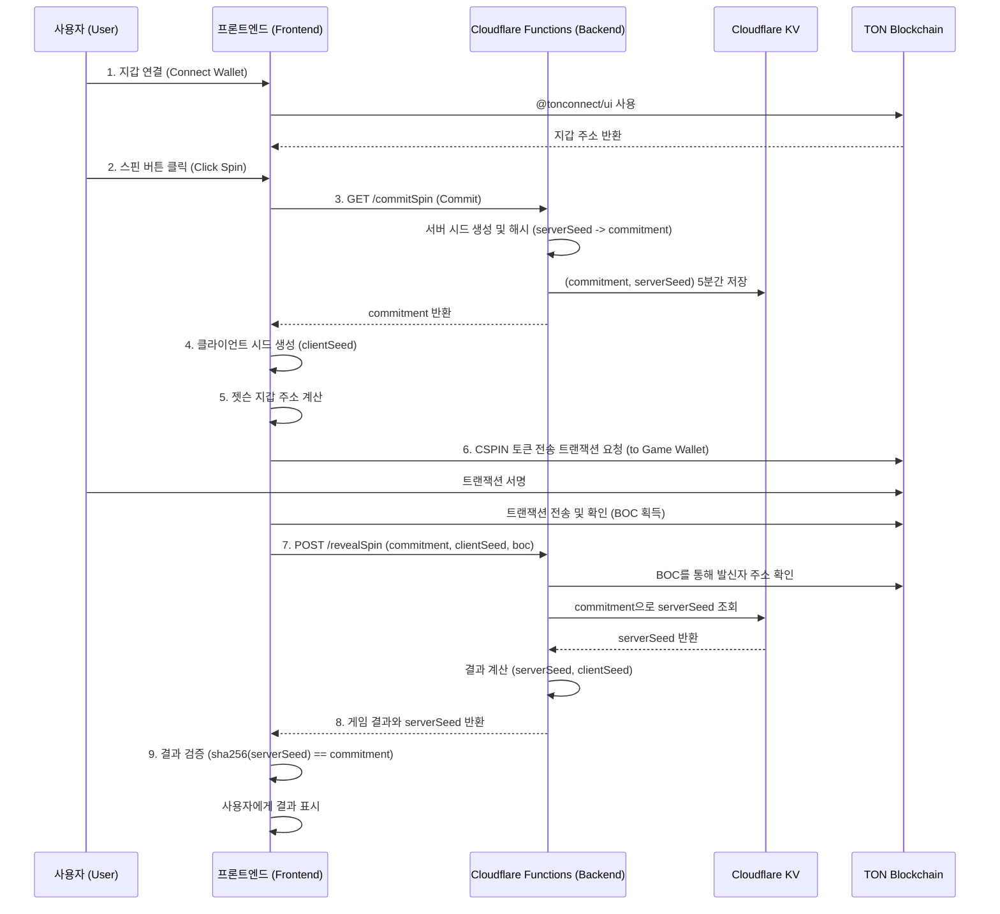

# CandleSpinner: Software Architecture Document

## 1. Overview

(KO) 이 문서는 'CandleSpinner' 프로젝트의 기술적 아키텍처를 정의합니다. 시스템의 구조, 구성 요소, 데이터 흐름, API 명세 등을 상세히 기술하여 일관성 있는 개발을 위한 기술적 청사진을 제공하는 것을 목표로 합니다.
(EN) This document defines the technical architecture for the 'CandleSpinner' project. It aims to provide a technical blueprint for consistent development by detailing the system structure, components, data flow, and API specifications.

## 2. Core Philosophy

(KO)
- **서버리스 우선 (Serverless-First):** 모든 인프라는 Cloudflare를 중심으로 구축하여, 별도의 서버 관리 없이 높은 확장성과 비용 효율성을 추구합니다.
- **비수탁형 자산 관리 (Non-Custodial):** 사용자의 자산은 항상 사용자의 지갑에 남아있으며, 프로젝트는 자산을 직접 보관하거나 통제하지 않습니다.
- **상태 비저장 백엔드 (Stateless Backend):** 각 API 함수는 독립적으로 실행되며 상태를 저장하지 않습니다. 상태 관리가 필요한 경우(예: 중복 지급 방지, Commit-Reveal) JWT와 Cloudflare KV를 사용합니다.
- **단일 진실 공급원 (Single Source of Truth):** 모든 요구사항과 아키텍처 정보는 `docs` 폴더 내의 문서들을 통해 관리됩니다.

(EN)
- **Serverless-First:** All infrastructure is built around Cloudflare, aiming for high scalability and cost-effectiveness without server management.
- **Non-Custodial Asset Management:** User assets always remain in the user's own wallet; the project does not store or control them directly.
- **Stateless Backend:** Each API function executes independently and does not store state. State management (e.g., preventing duplicate payouts, Commit-Reveal) is handled using JWT and Cloudflare KV.
- **Single Source of Truth:** All requirements and architectural information are managed through documents in the `docs` folder.

## 3. Core Architectural Principles & Constraints

(KO) AI 에이전트는 코드 생성 시 아래의 설계 규칙을 반드시 준수해야 합니다.
(EN) The AI agent must strictly adhere to the following design rules when generating code.

- **규칙 1 (공정성):** 모든 확률 기반 로직(예: 스핀, 더블업)은 반드시 Commit-Reveal 스킴을 사용해야 한다 (Math.random 사용 절대 금지).
- **규칙 2 (보안):** JWT_SECRET, GAME_WALLET_SEED 등 모든 민감한 정보는 Cloudflare 환경 변수를 통해서만 접근해야 하며, 코드에 하드코딩하거나 대체 값을 사용해서는 안 된다.
- **규칙 3 (의존성):** @tonconnect/ui 라이브러리는 안정성을 위해 NPM으로 설치하여 로컬에서 번들링하는 것을 원칙으로 한다 (관련 ADR-003 참조).
- **규칙 4 (데이터 조회):** 스마트 컨트랙트의 get 메소드 호출은 서버 불안정성을 유발하므로, 클라이언트 측에서 주소를 직접 계산하는 방식을 사용해야 한다 (관련 ADR-002 참조).
- **규칙 5 (트랜잭션 검증):** 모든 사용자 트랜잭션(BOC)은 서버 측에서 반드시 발신자 주소를 검증하여 소유권을 확인해야 한다 (관련 ADR-004 참조).

## 4. System Diagram

(KO) 아래는 시스템의 주요 구성 요소와 상호작용을 나타내는 다이어그램입니다.
(EN) Below is a diagram showing the main components of the system and their interactions.



## 5. Technology Stack & Rationale

| Category | Technology | Rationale (KO) | Rationale (EN) |
| :--- | :--- | :--- | :--- |
| **Frontend** | **Vite** | 빠른 개발 서버와 최적화된 빌드 성능을 제공하여 개발 생산성을 높입니다. | Provides a fast development server and optimized build performance, increasing development productivity. |
| | **Vanilla JS/HTML/CSS** | 외부 UI 프레임워크에 대한 의존성 없이 가볍고 빠른 사용자 경험을 제공합니다. | Delivers a lightweight and fast user experience without dependency on external UI frameworks. |
| **Backend** | **Cloudflare Functions** | 서버 관리가 필요 없는 서버리스 환경을 제공하며, 글로벌 엣지 네트워크를 통해 빠른 응답 속도를 보장합니다. | Offers a serverless environment requiring no server management and ensures fast response times via a global edge network. |
| **Hosting** | **Cloudflare Pages** | Git 푸시를 통해 간편하게 프론트엔드를 배포하고, Functions와 완벽하게 통합됩니다. | Easily deploys the frontend via Git push and integrates seamlessly with Functions. |
| **Blockchain** | **TON (The Open Network)** | 낮은 수수료와 빠른 트랜잭션 속도를 제공하며, Telegram과의 연동을 통해 높은 접근성을 가집니다. | Offers low fees, fast transaction speeds, and high accessibility through its integration with Telegram. |
| **Libraries** | **@tonconnect/ui** | TON 지갑 연결을 위한 공식 UI 라이브러리로, 다양한 지갑과의 호환성을 보장합니다. | The official UI library for TON wallet connections, ensuring compatibility with various wallets. |
| | **@ton/core, @ton/ton** | TON 블록체인 상호작용을 위한 최신 공식 라이브러리로, 안정성과 유지보수성을 보장합니다. | The latest official libraries for TON blockchain interaction, ensuring stability and maintainability. |
| | **jose** | 백엔드에서 상태 비저장 "당첨 티켓"을 안전하게 생성하고 검증하기 위한 표준 JWT 라이브러리입니다. | A standard JWT library for securely creating and verifying stateless "win tickets" on the backend. |
| **Storage** | **Cloudflare KV** | Commit-Reveal 스킴의 `(commitment, serverSeed)` 쌍과 같이, 짧은 만료 시간을 갖는 키-값 데이터를 저장하기 위한 글로벌 저지연 스토리지입니다. | A global, low-latency key-value store for short-lived data like the `(commitment, serverSeed)` pair in the Commit-Reveal scheme. |

## 6. Directory Structure

```
.
├── docs/                   # (KO) 모든 프로젝트 문서 (EN) All project documents
│   └── adr/                # (KO) 아키텍처 결정 기록 (EN) Architecture Decision Records
├── functions/              # (KO) Cloudflare Functions (백엔드 API) (EN) Cloudflare Functions (Backend API)
│   ├── commitSpin.js
│   ├── revealSpin.js
│   ├── claimPrize.js
│   └── doubleUp.js
├── public/                 # (KO) 정적 에셋 (이미지, 폰트, 언어 파일) (EN) Static assets (images, fonts, language files)
│   ├── lang/
│   │   ├── en.json
│   │   └── ko.json
│   └── icon.png
├── src/                    # (KO) 프론트엔드 소스 코드 (EN) Frontend source code
│   ├── services/           # (KO) 외부 서비스 연동 로직 (EN) Logic for external service integration
│   │   ├── api.js          # (KO) 백엔드 API 호출 (EN) Backend API calls
│   │   └── blockchain.js   # (KO) TON 블록체인 상호작용 (EN) TON blockchain interactions
│   ├── main.js             # (KO) 애플리케이션 진입점 (EN) Application entry point
│   └── style.css           # (KO) 기본 스타일시트 (EN) Base stylesheet
├── .gitignore
├── _routes.json            # (KO) Cloudflare Pages 라우팅 규칙 (EN) Cloudflare Pages routing rules
├── index.html              # (KO) 메인 HTML 파일 (EN) Main HTML file
├── package.json            # (KO) 프로젝트 의존성 및 스크립트 (EN) Project dependencies and scripts
├── vite.config.js          # (KO) Vite 빌드 설정 (EN) Vite build configuration
└── wrangler.toml           # (KO) Cloudflare Functions 설정 (EN) Cloudflare Functions configuration
```

## 7. API Endpoint Specification

(API 명세는 생략, 기존 내용과 동일)

## 8. Architecture Decision Records (ADR)

| ID | 제목 (Title) | 상태 (Status) | 요약 (Summary) |
|---|---|---|---|
| ADR-001 | TON 라이브러리 스택 현대화 | 채택됨 (Accepted) | (KO) 배포 안정성을 위해 tonweb을 @ton/core 및 @ton/ton으로 교체<br>(EN) Replaced tonweb with @ton/core and @ton/ton for deployment stability. |
| ADR-002 | 백엔드 RPC 프록시 패턴 도입 | 대체됨 (Superseded) | (KO) 클라이언트 측 주소 계산 방식이 더 안정적이므로 해당 아키텍처는 폐기<br>(EN) Discarded as client-side address calculation is more stable. |
| ADR-003 | @tonconnect/ui 하이브리드 모델 | 채택됨 (Accepted) | (KO) 초기에는 CDN을 사용했으나, 현재는 NPM 방식으로 안정화하여 사용<br>(EN) Initially used CDN, but now stabilized using the NPM method. |
| ADR-004 | 스핀 트랜잭션 검증 강화 | 채택됨 (Accepted) | (KO) 트랜잭션 소유권 검증 및 위조 티켓 방지 로직 추가<br>(EN) Added transaction ownership verification and anti-counterfeit ticket logic. |
