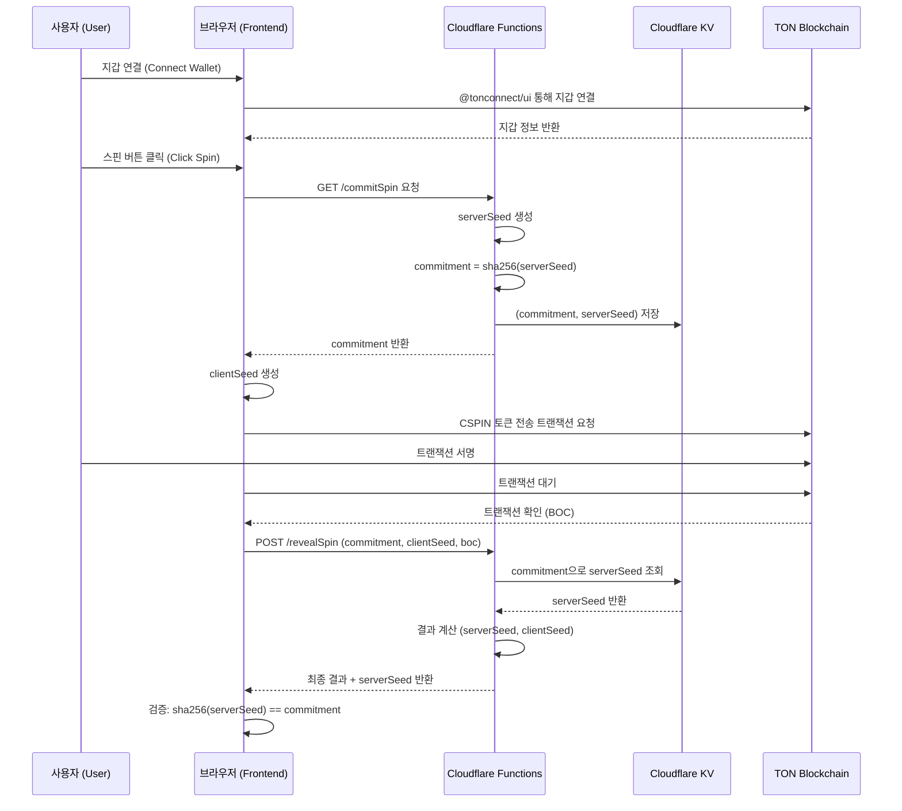

-----

# CandleSpinner: Software Architecture Document

## 1\. Overview

(KO) 이 문서는 'CandleSpinner' 프로젝트의 기술적 아키텍처를 정의합니다. 시스템의 구조, 구성 요소, 데이터 흐름, API 명세 등을 상세히 기술하여 일관성 있는 개발을 위한 기술적 청사진을 제공하는 것을 목표로 합니다.
(EN) This document defines the technical architecture for the 'CandleSpinner' project. It aims to provide a technical blueprint for consistent development by detailing the system structure, components, data flow, and API specifications.

-----

## 2\. Core Philosophy

(KO)

  - **서버리스 우선 (Serverless-First):** 모든 인프라는 Cloudflare를 중심으로 구축하여, 별도의 서버 관리 없이 높은 확장성과 비용 효율성을 추구합니다.
  - **비수탁형 자산 관리 (Non-Custodial):** 사용자의 자산은 항상 사용자의 지갑에 남아있으며, 프로젝트는 자산을 직접 보관하거나 통제하지 않습니다.
  - **상태 비저장 백엔드 (Stateless Backend):** 각 API 함수는 독립적으로 실행되며 상태를 저장하지 않습니다. 상태 관리가 필요한 경우(예: 중복 지급 방지, Commit-Reveal) JWT와 Cloudflare KV를 사용합니다.
  - **단일 진실 공급원 (Single Source of Truth):** 모든 요구사항과 아키텍처 정보는 `docs` 폴더 내의 문서들을 통해 관리됩니다.

(EN)

  - **Serverless-First:** All infrastructure is built around Cloudflare, aiming for high scalability and cost-effectiveness without server management.
  - **Non-Custodial Asset Management:** User assets always remain in the user's own wallet; the project does not store or control them directly.
  - **Stateless Backend:** Each API function executes independently and does not store state. State management (e.g., preventing duplicate payouts, Commit-Reveal) is handled using JWT and Cloudflare KV.
  - **Single Source of Truth:** All requirements and architectural information are managed through documents in the `docs` folder.

-----

## 3\. System Diagram

(KO) 아래는 시스템의 주요 구성 요소와 상호작용을 나타내는 다이어그램입니다.
(EN) Below is a diagram showing the main components of the system and their interactions.



-----

## 4\. Technology Stack & Rationale

| Category | Technology | Rationale (KO) | Rationale (EN) |
| :--- | :--- | :--- | :--- |
| **Frontend** | **Vite** | 빠른 개발 서버와 최적화된 빌드 성능을 제공하여 개발 생산성을 높입니다. | Provides a fast development server and optimized build performance, increasing development productivity. |
| | **Vanilla JS/HTML/CSS** | 외부 UI 프레임워크에 대한 의존성 없이 가볍고 빠른 사용자 경험을 제공합니다. | Delivers a lightweight and fast user experience without dependency on external UI frameworks. |
| **Backend** | **Cloudflare Functions** | 서버 관리가 필요 없는 서버리스 환경을 제공하며, 글로벌 엣지 네트워크를 통해 빠른 응답 속도를 보장합니다. | Offers a serverless environment requiring no server management and ensures fast response times via a global edge network. |
| **Hosting** | **Cloudflare Pages** | Git 푸시를 통해 간편하게 프론트엔드를 배포하고, Functions와 완벽하게 통합됩니다. | Easily deploys the frontend via Git push and integrates seamlessly with Functions. |
| **Blockchain** | **TON (The Open Network)** | 낮은 수수료와 빠른 트랜잭션 속도를 제공하며, Telegram과의 연동을 통해 높은 접근성을 가집니다. | Offers low fees, fast transaction speeds, and high accessibility through its integration with Telegram. |
| **Libraries** | **@tonconnect/ui** | TON 지갑 연결을 위한 공식 UI 라이브러리로, 다양한 지갑과의 호환성을 보장합니다. | The official UI library for TON wallet connections, ensuring compatibility with various wallets. |
| | **@ton/core, @ton/ton** | TON 블록체인 상호작용을 위한 최신 공식 라이브러리로, 안정성과 유지보수성을 보장합니다. | The latest official libraries for TON blockchain interaction, ensuring stability and maintainability. |
| | **jose** | 백엔드에서 상태 비저장 "당첨 티켓"을 안전하게 생성하고 검증하기 위한 표준 JWT 라이브러리입니다. | A standard JWT library for securely creating and verifying stateless "win tickets" on the backend. |
| **Storage** | **Cloudflare KV** | Commit-Reveal 스킴의 `(commitment, serverSeed)` 쌍과 같이, 짧은 만료 시간을 갖는 키-값 데이터를 저장하기 위한 글로벌 저지연 스토리지입니다. | A global, low-latency key-value store for short-lived data like the `(commitment, serverSeed)` pair in the Commit-Reveal scheme. |

-----

## 5\. Directory Structure

```
.
├── docs/                   # (KO) 모든 프로젝트 문서 (EN) All project documents
├── functions/              # (KO) Cloudflare Functions (백엔드 API) (EN) Cloudflare Functions (Backend API)
│   ├── commitSpin.js
│   ├── revealSpin.js
│   ├── claimPrize.js
│   └── doubleUp.js
├── public/                 # (KO) 정적 에셋 (이미지, 폰트, 언어 파일) (EN) Static assets (images, fonts, language files)
│   ├── lang/
│   │   ├── en.json
│   │   └── ko.json
│   └── icon.png
├── src/                    # (KO) 프론트엔드 소스 코드 (EN) Frontend source code
│   ├── main.js             # (KO) 애플리케이션 진입점 (EN) Application entry point
│   └── style.css           # (KO) 기본 스타일시트 (EN) Base stylesheet
├── .gitignore
├── _routes.json            # (KO) Cloudflare Pages 라우팅 규칙 (EN) Cloudflare Pages routing rules
├── index.html              # (KO) 메인 HTML 파일 (EN) Main HTML file
├── package.json            # (KO) 프로젝트 의존성 및 스크립트 (EN) Project dependencies and scripts
├── vite.config.js          # (KO) Vite 빌드 설정 (EN) Vite build configuration
└── wrangler.toml           # (KO) Cloudflare Functions 설정 (EN) Cloudflare Functions configuration
```

-----

## 6\. Key Data Flow

(KO)

1.  **지갑 연결:** 사용자가 `@tonconnect/ui` 버튼을 통해 지갑을 연결합니다.
2.  **베팅 및 스핀 (Commit-Reveal 스킴):**
      * **Commit 단계:** 사용자가 '스핀'을 클릭하면, 프론트엔드는 백엔드 `GET /commitSpin` API를 호출합니다. 백엔드는 암호학적으로 안전한 `serverSeed`를 생성하고, 그것의 해시 값인 `commitment`를 생성하여 Cloudflare KV에 `serverSeed`와 함께 저장한 후, `commitment`를 프론트엔드에 반환합니다.
      * **Reveal 단계:** 프론트엔드는 `commitment`를 받은 후, 자체적으로 `clientSeed`를 생성하고, 베팅 트랜잭션을 사용자에게 요청하여 서명받습니다. 트랜잭션이 완료되면, 프론트엔드는 `POST /revealSpin` API를 `commitment`, `clientSeed`, 트랜잭션 정보(BOC)와 함께 호출합니다.
3.  **결과 생성 및 검증:**
      * `/revealSpin` 함수는 KV에서 `serverSeed`를 조회하고, `serverSeed`와 `clientSeed`를 조합하여 결정론적인 게임 결과를 생성합니다.
      * 백엔드는 최종 결과와 함께, 검증을 위해 원본 `serverSeed`를 프론트엔드에 반환합니다.
      * 프론트엔드는 수신한 `serverSeed`를 해시하여 최초에 받은 `commitment`와 일치하는지 자동으로 검증하고, 결과를 사용자에게 표시합니다.
4.  **당첨 티켓 발급 및 상금 수령:**
      * 스핀 결과 당첨 시, `/revealSpin` API는 이전과 동일하게 JWT("당첨 티켓")를 발급합니다.
      * 상금 수령 및 더블업 로직은 기존과 동일하게 `/claimPrize`, `/doubleUp` API를 통해 처리됩니다.

(EN)

1.  **Wallet Connection:** The user connects their wallet via the `@tonconnect/ui` button.
2.  **Betting and Spinning (Commit-Reveal Scheme):**
      * **Commit Phase:** When the user clicks 'Spin', the frontend calls the `GET /commitSpin` backend API. The backend generates a cryptographically secure `serverSeed`, creates a hash of it (`commitment`), stores both in Cloudflare KV, and returns the `commitment` to the frontend.
      * **Reveal Phase:** After receiving the `commitment`, the frontend generates its own `clientSeed` and requests the user to sign the betting transaction. Once the transaction is complete, the frontend calls the `POST /revealSpin` API with the `commitment`, `clientSeed`, and transaction info (BOC).
3.  **Result Generation and Verification:**
      * The `/revealSpin` function retrieves the `serverSeed` from KV and combines it with the `clientSeed` to deterministically generate the game outcome.
      * The backend returns the final result along with the original `serverSeed` for verification purposes.
      * The frontend automatically verifies the integrity by hashing the received `serverSeed` and comparing it to the initial `commitment`, then displays the result to the user.
4.  **Issuing Win Ticket and Claiming Prize:**
      * If the spin is a win, the `/revealSpin` API issues a JWT ("win ticket") as before.
      * The prize claim and double-up logic remain the same, handled by the `/claimPrize` and `/doubleUp` APIs.

-----

## 7\. API Endpoint Specification

### 7.1. `GET /commitSpin`

  - **(KO) 설명:** Commit-Reveal 스킴의 'Commit' 단계를 수행합니다. 서버 시드를 기반으로 한 해시(commitment)를 생성하여 반환합니다.
  - **(EN) Description:** Performs the 'Commit' phase of the Commit-Reveal scheme. Generates and returns a hash (commitment) based on a server seed.
  - **Request Body:** None
  - **Success Response:**
    ```json
    {
      "success": true,
      "commitment": "string" // (KO) 서버 시드의 SHA-256 해시 (EN) SHA-256 hash of the server seed
    }
    ```
  - **Error Response:**
    ```json
    {
      "success": false,
      "errorCode": "KV_ERROR | INTERNAL_SERVER_ERROR",
      "message": "string"
    }
    ```

### 7.2. `POST /revealSpin`

  - **(KO) 설명:** Commit-Reveal 스킴의 'Reveal' 단계를 수행합니다. 사용자의 베팅을 검증하고, 서버/클라이언트 시드를 조합하여 최종 결과를 반환합니다.
  - **(EN) Description:** Performs the 'Reveal' phase of the Commit-Reveal scheme. Validates the user's bet and combines server/client seeds to return the final result.
  - **Request Body:**
    ```json
    {
      "commitment": "string",  // (KO) /commitSpin에서 받은 해시 (EN) Hash received from /commitSpin
      "clientSeed": "string",  // (KO) 클라이언트가 생성한 시드 (EN) Seed generated by the client
      "boc": "string",         // (KO) 사용자가 서명한 트랜잭션의 Base64 BOC (EN) Base64 BOC of the user-signed transaction
      "betAmount": "number",   // (KO) 베팅 금액 (EN) The bet amount
      "userAddress": "string"  // (KO) 사용자 지갑 주소 (EN) User's wallet address
    }
    ```
  - **Success Response (Win):**
    ```json
    {
      "success": true,
      "reels": [ ... ],
      "win": true,
      "payout": 100,
      "winTicket": "string", // (KO) JWT 당첨 티켓 (EN) JWT win ticket
      "serverSeed": "string" // (KO) 검증을 위한 원본 서버 시드 (EN) Original server seed for verification
    }
    ```
  - **Success Response (Lose):**
    ```json
    {
      "success": true,
      "reels": [ ... ],
      "win": false,
      "payout": 0,
      "serverSeed": "string" // (KO) 검증을 위한 원본 서버 시드 (EN) Original server seed for verification
    }
    ```
  - **Error Response:**
    ```json
    {
      "success": false,
      "errorCode": "INVALID_COMMITMENT | COMMITMENT_NOT_FOUND | INVALID_TRANSACTION | ...",
      "message": "string"
    }
    ```

### 7.3. `POST /claimPrize`

  - **(KO) 설명:** 당첨 티켓을 검증하고 사용자에게 상금을 전송합니다.
  - **(EN) Description:** Validates the win ticket and sends the prize to the user.
  - **Request Body:**
    ```json
    {
      "winTicket": "string" // (KO) /revealSpin에서 발급받은 JWT (EN) JWT received from /revealSpin
    }
    ```
  - **Success Response:**
    ```json
    {
      "success": true,
      "transaction": {
        "txHash": "string",
        "amount": 100
      }
    }
    ```
  - **Error Response:**
    ```json
    {
      "success": false,
      "errorCode": "INVALID_TICKET | TICKET_EXPIRED | TICKET_ALREADY_USED | INSUFFICIENT_FUNDS",
      "message": "string"
    }
    ```

### 7.4. `POST /doubleUp`

  - **(KO) 설명:** 더블업 미니게임을 실행하고, 성공 시 새로운 당첨 티켓을 발급합니다. **(참고: 더블업은 현재 Commit-Reveal 스킴 미적용)**
  - **(EN) Description:** Executes the double-up minigame and issues a new win ticket on success. **(Note: Double-up does not currently use the Commit-Reveal scheme)**
  - **Request Body:**
    ```json
    {
      "winTicket": "string", // (KO) 현재 보유한 JWT (EN) The current JWT
      "choice": "red | black" // (KO) 사용자의 선택 (EN) The user's choice
    }
    ```
  - **Success Response (Win):**
    ```json
    {
      "success": true,
      "win": true,
      "newPayout": 200,
      "newTicket": "string" // (KO) 두 배의 상금이 담긴 새로운 JWT (EN) New JWT with double the prize
    }
    ```
  - **Success Response (Lose):**
    ```json
    {
      "success": true,
      "win": false,
      "newPayout": 0
    }
    ```
  - **Error Response:**
    ```json
    {
      "success": false,
      "errorCode": "INVALID_TICKET | MAX_DOUBLE_UP_REACHED | ...",
      "message": "string"
    }
    ```
-----

## 8\. Architecture Decision Records (ADR)

(KO) 이 프로젝트의 주요 아키텍처 결정 사항은 `docs/adr` 폴더에 기록되어 있습니다. 이 기록들은 왜 현재와 같은 기술적 선택을 했는지에 대한 중요한 역사적 맥락을 제공합니다.
(EN) Major architectural decisions for this project are documented in the `docs/adr` folder. These records provide important historical context on why certain technical choices were made.

  - **[ADR-001](https://www.google.com/search?q=./adr/20251008-modernize-ton-library-stack.md):** `tonweb` 라이브러리를 제거하고 최신 `@ton/core` 및 `@ton/ton`으로 전환. (EN: Replaced `tonweb` with modern `@ton/core` and `@ton/ton` libraries.)
  - **[ADR-002](https://www.google.com/search?q=./adr/20251008-backend-rpc-proxy-for-get-methods.md):** 클라이언트 측 RPC 호출의 안정성 문제를 해결하기 위해 백엔드 프록시 패턴 도입. (EN: Introduced a backend proxy pattern to resolve client-side RPC call instability.)
  - **[ADR-003](https://www.google.com/search?q=./adr/20251008-hybrid-dependency-model-for-tonconnect-ui.md):** `@tonconnect/ui`의 렌더링 안정성을 위해 CDN 기반 하이브리드 의존성 모델 채택. (EN: Adopted a hybrid CDN-based dependency model for `@tonconnect/ui` rendering stability.)