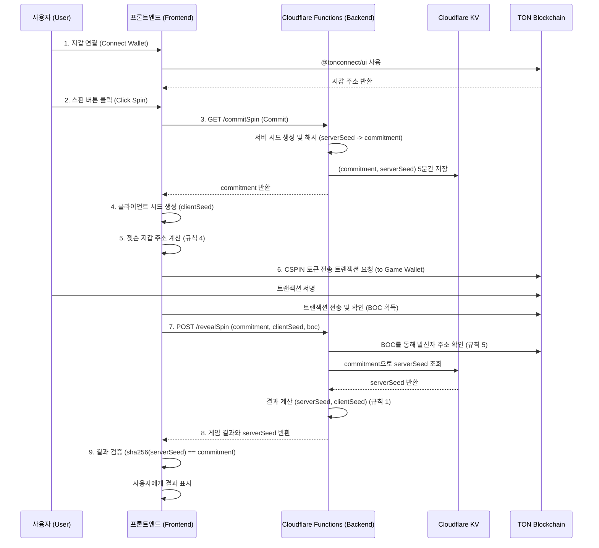

# CandleSpinner: Software Architecture Document

## 1. Overview

(KO) 이 문서는 'CandleSpinner' 프로젝트의 기술적 아키텍처를 정의합니다. 시스템의 구조, 구성 요소, 데이터 흐름, API 명세 등을 상세히 기술하여 일관성 있는 개발을 위한 기술적 청사진을 제공하는 것을 목표로 합니다.
(EN) This document defines the technical architecture for the 'CandleSpinner' project. It aims to provide a technical blueprint for consistent development by detailing the system structure, components, data flow, and API specifications.

---

## 2. Core Philosophy

(KO)
- **서버리스 우선 (Serverless-First):** 모든 인프라는 Cloudflare를 중심으로 구축하여, 별도의 서버 관리 없이 높은 확장성과 비용 효율성을 추구합니다.
- **비수탁형 자산 관리 (Non-Custodial):** 사용자의 자산은 항상 사용자의 지갑에 남아있으며, 프로젝트는 자산을 직접 보관하거나 통제하지 않습니다.
- **상태 비저장 백엔드 (Stateless Backend):** 각 API 함수는 독립적으로 실행되며 상태를 저장하지 않습니다. 상태 관리가 필요한 경우(예: 중복 지급 방지, Commit-Reveal) JWT와 Cloudflare KV를 사용합니다.
- **단일 진실 공급원 (Single Source of Truth):** 모든 요구사항과 아키텍처 정보는 `docs` 폴더 내의 문서들을 통해 관리됩니다.

(EN)
- **Serverless-First:** All infrastructure is built around Cloudflare, aiming for high scalability and cost-effectiveness without server management.
- **Non-Custodial Asset Management:** User assets always remain in the user's own wallet; the project does not store or control them directly.
- **Stateless Backend:** Each API function executes independently and does not store state. State management (e.g., preventing duplicate payouts, Commit-Reveal) is handled using JWT and Cloudflare KV.
- **Single Source of Truth:** All requirements and architectural information are managed through documents in the `docs` folder.

---

## 3. 설계 규칙 (Design Rules - AI MUST FOLLOW)

> **중요:** 이 규칙들은 절대적입니다. 위반 시 PR 자동 거부.

### 규칙 1 (공정성): 확률 로직은 Commit-Reveal만 사용

- **적용 대상:** 스핀 결과, 더블업 승/패, 모든 랜덤 이벤트
- **금지:** `Math.random()`, `Date.now() % 2`, 서버 단독 결정
- **필수:** Commit 단계 → 사용자 입력 → Reveal 단계
- **검증 방법:**
  ```bash
  grep -r "Math.random()" functions/
  # 결과: 0개 (성공)
  ```
- **관련 ADR:** ADR-001 (Commit-Reveal 도입)
- **예외:** 없음

### 규칙 2 (보안): 환경 변수 외 비밀 정보 금지

- **적용 대상:** JWT_SECRET, GAME_WALLET_SEED, API_KEY
- **금지:** 하드코딩, 대체 값(fallback), 주석에 포함
- **필수:** `env.XXX` 또는 즉시 실패
- **검증 방법:**
  ```javascript
  // ❌ 잘못된 예시
  const secret = env.JWT_SECRET || "default-secret";
  
  // ✅ 올바른 예시
  const secret = env.JWT_SECRET;
  if (!secret) throw new Error("JWT_SECRET required");
  ```
- **관련 ADR:** 없음 (기본 보안 정책)

### 규칙 3 (의존성): @tonconnect/ui는 NPM 번들링

- **적용 대상:** `@tonconnect/ui` 라이브러리
- **금지:** CDN 로드 (`<script src="https://..."`)
- **필수:** `npm install @tonconnect/ui` 후 번들링
- **검증 방법:**
  ```bash
  grep "unpkg.com/@tonconnect" index.html
  # 결과: 0개 (성공)
  ```
- **관련 ADR:** ADR-003 (하이브리드 의존성 모델)
- **이유:** CDN 불안정으로 인한 렌더링 실패 방지

### 규칙 4 (블록체인): 젯슨 주소는 클라이언트에서 계산

- **적용 대상:** 사용자의 Jetton 지갑 주소 조회
- **금지:** 
  - `/getJettonWalletAddress` API 호출 (폐기됨)
  - `tonClient.runMethod()` 서버 호출
- **필수:** `@ton/core`의 `beginCell()` 사용하여 클라이언트 계산
- **검증 방법:**
  ```javascript
  // ✅ 올바른 예시 (blockchain.js)
  import { beginCell, Address } from '@ton/core';
  
  function calculateJettonWallet(ownerAddress, jettonMaster) {
    const stateInit = ... // 표준 Jetton 지갑 StateInit
    const address = contractAddress(0, stateInit);
    return address;
  }
  ```
- **관련 ADR:** ADR-002 (백엔드 RPC 프록시 - 폐기됨)
- **이유:** 서버 RPC의 불안정성 및 exit_code -13 오류 방지

### 규칙 5 (트랜잭션 검증): 트랜잭션은 발신자 검증 필수

- **적용 대상:** `/revealSpin`, `/claimPrize` 등 모든 BOC 처리
- **금지:** BOC 내용만 신뢰
- **필수:** BOC를 파싱하여 발신자 주소 확인 후 요청자와 대조
- **검증 방법:**
  ```javascript
  // ✅ 올바른 예시 (revealSpin.js)
  import { Cell } from '@ton/core';
  
  const boc = Cell.fromBase64(request.boc);
  const parsedTx = parseTransaction(boc);
  const sender = parsedTx.sender;
  
  if (sender !== request.userAddress) {
    return { error: "INVALID_SENDER" };
  }
  ```
- **관련 ADR:** ADR-004 (트랜잭션 검증 강화)
- **이유:** 위조 티켓 방지

---

## 3.5. 규칙 준수 자동 검증 스크립트

다음 스크립트를 `.git/hooks/pre-commit`에 추가하거나 CI/CD에서 실행:

```bash
#!/bin/bash

echo "🔍 설계 규칙 검증 중..."

# 규칙 1: Math.random() 검사
if grep -r "Math.random()" functions/ src/ 2>/dev/null; then
  echo "❌ 규칙 1 위반: Math.random() 사용 금지"
  exit 1
fi

# 규칙 2: 환경 변수 하드코딩 검사
if grep -rE "(JWT_SECRET|GAME_WALLET_SEED).*=.*['\"]" functions/ 2>/dev/null; then
  echo "❌ 규칙 2 위반: 비밀 키 하드코딩 금지"
  exit 1
fi

# 규칙 3: CDN 사용 검사
if grep "unpkg.com/@tonconnect" index.html 2>/dev/null; then
  echo "❌ 규칙 3 위반: @tonconnect/ui CDN 사용 금지"
  exit 1
fi

# 규칙 4: RPC 프록시 호출 검사
if grep -r "/getJettonWalletAddress" src/ 2>/dev/null; then
  echo "❌ 규칙 4 위반: 폐기된 RPC 프록시 사용 금지"
  exit 1
fi

echo "✅ 모든 설계 규칙 준수 확인"
```

---

## 4. System Diagram

(KO) 아래는 시스템의 주요 구성 요소와 상호작용을 나타내는 다이어그램입니다.
(EN) Below is a diagram showing the main components of the system and their interactions.



---

## 5. Technology Stack & Rationale

| Category | Technology | Rationale (KO) | Rationale (EN) |
| :--- | :--- | :--- | :--- |
| **Frontend** | **Vite** | 빠른 개발 서버와 최적화된 빌드 성능을 제공하여 개발 생산성을 높입니다. | Provides a fast development server and optimized build performance, increasing development productivity. |
| | **Vanilla JS/HTML/CSS** | 외부 UI 프레임워크에 대한 의존성 없이 가볍고 빠른 사용자 경험을 제공합니다. | Delivers a lightweight and fast user experience without dependency on external UI frameworks. |
| **Backend** | **Cloudflare Functions** | 서버 관리가 필요 없는 서버리스 환경을 제공하며, 글로벌 엣지 네트워크를 통해 빠른 응답 속도를 보장합니다. | Offers a serverless environment requiring no server management and ensures fast response times via a global edge network. |
| **Hosting** | **Cloudflare Pages** | Git 푸시를 통해 간편하게 프론트엔드를 배포하고, Functions와 완벽하게 통합됩니다. | Easily deploys the frontend via Git push and integrates seamlessly with Functions. |
| **Blockchain** | **TON (The Open Network)** | 낮은 수수료와 빠른 트랜잭션 속도를 제공하며, Telegram과의 연동을 통해 높은 접근성을 가집니다. | Offers low fees, fast transaction speeds, and high accessibility through its integration with Telegram. |
| **Libraries** | **@tonconnect/ui** | TON 지갑 연결을 위한 공식 UI 라이브러리로, 다양한 지갑과의 호환성을 보장합니다. | The official UI library for TON wallet connections, ensuring compatibility with various wallets. |
| | **@ton/core, @ton/ton** | TON 블록체인 상호작용을 위한 최신 공식 라이브러리로, 안정성과 유지보수성을 보장합니다. | The latest official libraries for TON blockchain interaction, ensuring stability and maintainability. |
| | **jose** | 백엔드에서 상태 비저장 "당첨 티켓"을 안전하게 생성하고 검증하기 위한 표준 JWT 라이브러리입니다. | A standard JWT library for securely creating and verifying stateless "win tickets" on the backend. |
| **Storage** | **Cloudflare KV** | Commit-Reveal 스킴의 `(commitment, serverSeed)` 쌍과 같이, 짧은 만료 시간을 갖는 키-값 데이터를 저장하기 위한 글로벌 저지연 스토리지입니다. | A global, low-latency key-value store for short-lived data like the `(commitment, serverSeed)` pair in the Commit-Reveal scheme. |

---

## 6. Directory Structure

```
.
├── docs/                   # (KO) 모든 프로젝트 문서 (EN) All project documents
│   ├── adr/                # (KO) 아키텍처 결정 기록 (EN) Architecture Decision Records
│   └── reports/            # (KO) 분석 및 개선 보고서 (EN) Analysis and improvement reports
├── functions/              # (KO) Cloudflare Functions (백엔드 API) (EN) Cloudflare Functions (Backend API)
│   ├── commitSpin.js
│   ├── revealSpin.js
│   ├── claimPrize.js
│   └── doubleUp.js
├── public/                 # (KO) 정적 에셋 (이미지, 폰트, 언어 파일) (EN) Static assets (images, fonts, language files)
│   ├── lang/
│   │   ├── en.json
│   │   └── ko.json
│   └── icon.png
├── src/                    # (KO) 프론트엔드 소스 코드 (EN) Frontend source code
│   ├── services/           # (KO) 외부 서비스 연동 로직 (EN) Logic for external service integration
│   │   ├── api.js          # (KO) 백엔드 API 호출 (EN) Backend API calls
│   │   └── blockchain.js   # (KO) TON 블록체인 상호작용 (EN) TON blockchain interactions
│   ├── main.js             # (KO) 애플리케이션 진입점 (EN) Application entry point
│   └── style.css           # (KO) 기본 스타일시트 (EN) Base stylesheet
├── .gitignore
├── _routes.json            # (KO) Cloudflare Pages 라우팅 규칙 (EN) Cloudflare Pages routing rules
├── index.html              # (KO) 메인 HTML 파일 (EN) Main HTML file
├── package.json            # (KO) 프로젝트 의존성 및 스크립트 (EN) Project dependencies and scripts
├── vite.config.js          # (KO) Vite 빌드 설정 (EN) Vite build configuration
└── wrangler.toml           # (KO) Cloudflare Functions 설정 (EN) Cloudflare Functions configuration
```

---

## 7. API Endpoint Specification

### 7.1. GET /commitSpin

- **(KO) 설명:** Commit-Reveal 스킴의 'Commit' 단계를 수행합니다. 서버 시드를 기반으로 한 해시(commitment)를 생성하여 반환합니다.
- **(EN) Description:** Performs the 'Commit' phase of the Commit-Reveal scheme. Generates and returns a hash (commitment) based on a server seed.
- **Request Body:** None

**Example Request:**
```bash
curl https://candlespinner.pages.dev/commitSpin
```

**Success Response:**
```json
{
  "success": true,
  "commitment": "a1b2c3d4e5f6..." // (KO) 서버 시드의 SHA-256 해시 (EN) SHA-256 hash of server seed
}
```

**Error Response:**
```json
{
  "success": false,
  "errorCode": "KV_ERROR | INTERNAL_SERVER_ERROR",
  "message": "string"
}
```

---

### 7.2. POST /revealSpin

- **(KO) 설명:** Commit-Reveal 스킴의 'Reveal' 단계를 수행합니다. 사용자의 베팅을 검증하고, 서버/클라이언트 시드를 조합하여 최종 결과를 반환합니다.
- **(EN) Description:** Performs the 'Reveal' phase of the Commit-Reveal scheme. Validates the user's bet and combines server/client seeds to return the final result.

**Example Request:**
```bash
curl -X POST https://candlespinner.pages.dev/revealSpin \
  -H "Content-Type: application/json" \
  -d '{
    "commitment": "a1b2c3d4e5f6...",
    "clientSeed": "x9y8z7...",
    "boc": "te6cc...",
    "betAmount": 10,
    "userAddress": "UQB..."
  }'
```

**Request Body:**
```json
{
  "commitment": "string",  // (KO) /commitSpin에서 받은 해시 (EN) Hash received from /commitSpin
  "clientSeed": "string",  // (KO) 클라이언트가 생성한 시드 (EN) Seed generated by the client
  "boc": "string",         // (KO) 사용자가 서명한 트랜잭션의 Base64 BOC (EN) Base64 BOC of user-signed transaction
  "betAmount": "number",   // (KO) 베팅 금액 (EN) The bet amount
  "userAddress": "string"  // (KO) 사용자 지갑 주소 (EN) User's wallet address
}
```

**Success Response (Win):**
```json
{
  "success": true,
  "reels": [ ... ],
  "win": true,
  "payout": 100,
  "winTicket": "string", // (KO) JWT 당첨 티켓 (EN) JWT win ticket
  "serverSeed": "string" // (KO) 검증을 위한 원본 서버 시드 (EN) Original server seed for verification
}
```

**Success Response (Lose):**
```json
{
  "success": true,
  "reels": [ ... ],
  "win": false,
  "payout": 0,
  "serverSeed": "string"
}
```

**Error Response:**
```json
{
  "success": false,
  "errorCode": "INVALID_COMMITMENT | COMMITMENT_NOT_FOUND | INVALID_TRANSACTION | ...",
  "message": "string"
}
```

---

### 7.3. POST /claimPrize

- **(KO) 설명:** 당첨 티켓을 검증하고 사용자에게 상금을 전송합니다.
- **(EN) Description:** Validates the win ticket and sends the prize to the user.

<<<<<<< HEAD
  - **[ADR-001](https://www.google.com/search?q=./adr/20251008-modernize-ton-library-stack.md):** `tonweb` 라이브러리를 제거하고 최신 `@ton/core` 및 `@ton/ton`으로 전환. (EN: Replaced `tonweb` with modern `@ton/core` and `@ton/ton` libraries.)
  - **[ADR-002](https://www.google.com/search?q=./adr/20251008-backend-rpc-proxy-for-get-methods.md):** 클라이언트 측 RPC 호출의 안정성 문제를 해결하기 위해 백엔드 프록시 패턴 도입. (EN: Introduced a backend proxy pattern to resolve client-side RPC call instability.)
  - **[ADR-003](https://www.google.com/search?q=./adr/20251008-hybrid-dependency-model-for-tonconnect-ui.md):** `@tonconnect/ui`의 렌더링 안정성을 위해 CDN 기반 하이브리드 의존성 모델 채택. (EN: Adopted a hybrid CDN-based dependency model for `@tonconnect/ui` rendering stability.)

    - **[ADR-004](./adr/20251010-spin-tx-validation-and-error-logging.md):** (KO) 스핀 트랜잭션 입력값 검증 및 오류 로깅 로직 도입. (EN) Introduced validation logic and error logging for spin transaction creation.
=======
**Example Request:**
```bash
curl -X POST https://candlespinner.pages.dev/claimPrize \
  -H "Content-Type: application/json" \
  -d '{
    "winTicket": "eyJhbGci..."
  }'
```

**Request Body:**
```json
{
  "winTicket": "string" // (KO) /revealSpin에서 발급받은 JWT (EN) JWT received from /revealSpin
}
```

**Success Response:**
```json
{
  "success": true,
  "transaction": {
    "txHash": "string",
    "amount": 100
  }
}
```

**Error Response:**
```json
{
  "success": false,
  "errorCode": "INVALID_TICKET | TICKET_EXPIRED | TICKET_ALREADY_USED | INSUFFICIENT_FUNDS",
  "message": "string"
}
```

---

### 7.4. POST /doubleUp

- **(KO) 설명:** 더블업 미니게임을 실행하고, 성공 시 새로운 당첨 티켓을 발급합니다.
- **(EN) Description:** Executes the double-up minigame and issues a new win ticket on success.

**Example Request:**
```bash
curl -X POST https://candlespinner.pages.dev/doubleUp \
  -H "Content-Type: application/json" \
  -d '{
    "winTicket": "eyJhbGci...",
    "choice": "red"
  }'
```

**Request Body:**
```json
{
  "winTicket": "string", // (KO) 현재 보유한 JWT (EN) The current JWT
  "choice": "red | black" // (KO) 사용자의 선택 (EN) The user's choice
}
```

**Success Response (Win):**
```json
{
  "success": true,
  "win": true,
  "newPayout": 200,
  "newTicket": "string" // (KO) 두 배의 상금이 담긴 새로운 JWT (EN) New JWT with double the prize
}
```

**Success Response (Lose):**
```json
{
  "success": true,
  "win": false,
  "newPayout": 0
}
```

**Error Response:**
```json
{
  "success": false,
  "errorCode": "INVALID_TICKET | MAX_DOUBLE_UP_REACHED | ...",
  "message": "string"
}
```

---

## 8. Architecture Decision Records (ADR)

| ID | 제목 (Title) | 상태 (Status) | 요약 (Summary) | 영향받는 규칙 |
|---|---|---|---|---|
| ADR-001 | Commit-Reveal 도입 | ✅ Accepted | (KO) 검증 가능한 공정성을 위한 Commit-Reveal 스킴 도입<br>(EN) Introduced Commit-Reveal scheme for provable fairness | 규칙 1 |
| ADR-002 | 백엔드 RPC 프록시 | ❌ Superseded | (KO) 클라이언트 측 주소 계산 방식이 더 안정적이므로 해당 아키텍처는 폐기<br>(EN) Discarded as client-side address calculation is more stable | 규칙 4 |
| ADR-003 | @tonconnect/ui 하이브리드 모델 | ✅ Accepted | (KO) 초기에는 CDN을 사용했으나, 현재는 NPM 방식으로 안정화하여 사용<br>(EN) Initially used CDN, but now stabilized using the NPM method | 규칙 3 |
| ADR-004 | 스핀 트랜잭션 검증 강화 | ✅ Accepted | (KO) 트랜잭션 소유권 검증 및 위조 티켓 방지 로직 추가<br>(EN) Added transaction ownership verification and anti-counterfeit ticket logic | 규칙 5 |

**ADR 파일 위치:** `docs/adr/`
>>>>>>> 51e7e4273b85d9f139be292c0872379e4b88d685
